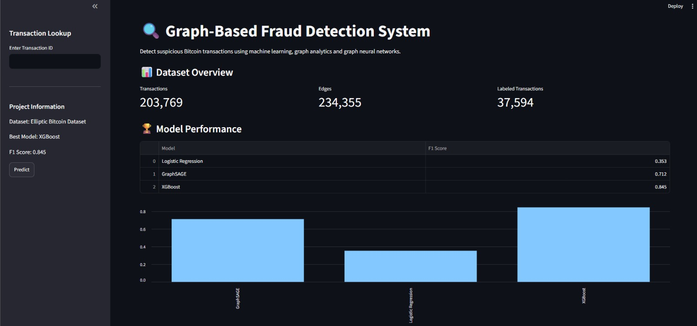
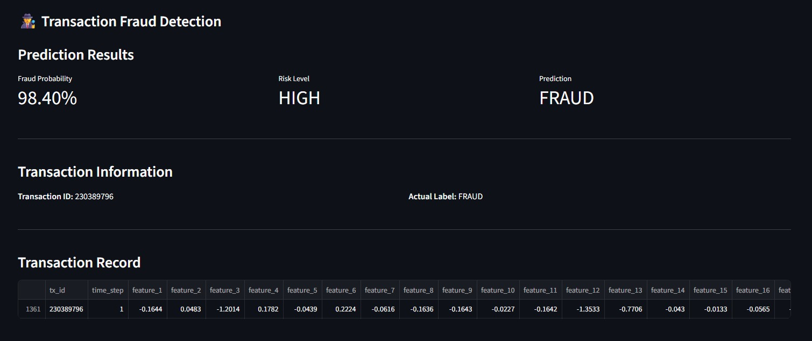
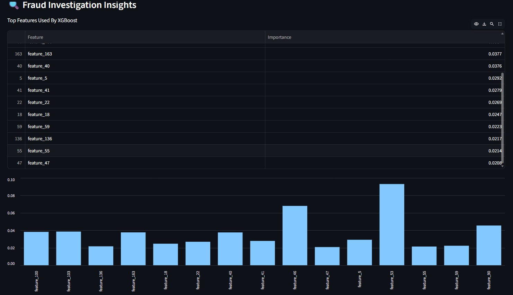
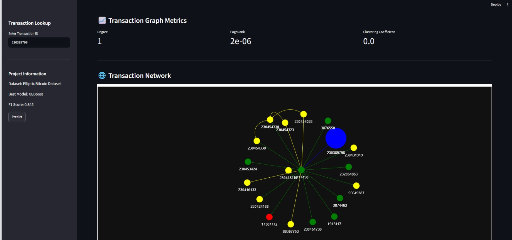

# Graph-Based Fraud Detection System

## Overview

A graph-based fraud detection system built on the Elliptic Bitcoin Dataset to identify illicit Bitcoin transactions using graph analytics, machine learning, and graph neural networks.

The project combines transaction features with network topology information extracted from a transaction graph to improve fraud detection performance and provide interactive fraud investigation capabilities.

---

## Key Features

* Transaction graph construction using NetworkX
* Graph feature engineering

  * Degree
  * In-Degree
  * Out-Degree
  * PageRank
  * Clustering Coefficient
* Temporal train-validation-test split
* Logistic Regression baseline model
* XGBoost fraud detection model
* GraphSAGE Graph Neural Network
* Interactive Streamlit dashboard
* Fraud probability prediction
* Feature importance explainability
* Interactive transaction network visualization

---

## Dataset

### Elliptic Bitcoin Dataset

The Elliptic Dataset is a real-world Bitcoin transaction dataset widely used for cryptocurrency fraud detection research.

| Metric                    |   Value |
| ------------------------- | ------: |
| Transactions              | 203,769 |
| Transaction Relationships | 234,355 |
| Labeled Transactions      |  37,594 |

### Labels

| Label   | Meaning    |
| ------- | ---------- |
| 1       | Fraudulent |
| 2       | Legitimate |
| Unknown | Unlabeled  |

---

## Project Architecture

```text
Elliptic Dataset
        ↓
Data Preprocessing
        ↓
Transaction Graph Construction
        ↓
Graph Feature Engineering
        ↓
Machine Learning Models
 ├── Logistic Regression
 ├── XGBoost
 └── GraphSAGE
        ↓
Fraud Prediction Engine
        ↓
Interactive Streamlit Dashboard
```

---

## Graph Features Engineered

The following graph topology features were extracted from the transaction network:

* Degree
* In-Degree
* Out-Degree
* PageRank
* Clustering Coefficient

These features help capture structural behavior within the transaction graph and improve fraud detection performance.

---

## Model Performance

Evaluation performed using a temporal train-validation-test split.

| Model               | F1 Score |
| ------------------- | -------: |
| Logistic Regression |    0.353 |
| GraphSAGE           |    0.712 |
| XGBoost             |    0.845 |

### Best Performing Model

**XGBoost**

Performance Metrics:

| Metric    | Score |
| --------- | ----: |
| Accuracy  | 0.973 |
| Precision | 0.905 |
| Recall    | 0.793 |
| F1 Score  | 0.845 |
| ROC-AUC   | 0.942 |

---

## Dashboard Screenshots

### Dashboard Overview



### Fraud Prediction



### Explainability & Graph Metrics



### Transaction Network Visualization



---

## Technologies Used

### Machine Learning

* Scikit-Learn
* XGBoost
* PyTorch
* PyTorch Geometric

### Data Processing

* Pandas
* NumPy

### Graph Analytics

* NetworkX
* PyVis

### Visualization & Application

* Streamlit

---

## Example Fraud Prediction

Input:

```text
Transaction ID: 232629023
```

Output:

```text
Fraud Probability: 99.63%
Risk Level: HIGH
Prediction: FRAUD
```

---

## Project Structure

```text
graph-based-fraud-detection/
│
├── app/
│   └── app.py
│
├── src/
│   ├── load_data.py
│   ├── preprocess.py
│   ├── graph_builder.py
│   ├── graph_analysis.py
│   ├── graph_features.py
│   ├── temporal_split.py
│   ├── logistic_model.py
│   ├── xgboost_model.py
│   ├── graph_data.py
│   ├── graphsage_model.py
│   ├── predictor.py
│   ├── explainability.py
│   └── network_visualization.py
│
├── models/
│   ├── logistic_model.pkl
│   └── xgboost_model.pkl
│
├── assets/
│   ├── dashboard.png
│   ├── fraud_prediction.png
│   ├── explainability.png
│   └── network_graph.png
│
├── README.md
└── requirements.txt
```

---

## Key Results

* Constructed a transaction graph with 203k+ Bitcoin transactions and 234k+ relationships.
* Engineered graph topology features for fraud detection.
* Achieved an F1 score of 0.845 using XGBoost.
* Implemented GraphSAGE for graph-based node classification.
* Developed an interactive fraud investigation dashboard with explainability and network visualization.

---

## Future Improvements

* Multi-hop fraud investigation networks
* Community detection for fraud rings
* Real-time transaction scoring
* SHAP-based model explainability
* Cloud deployment

---
s